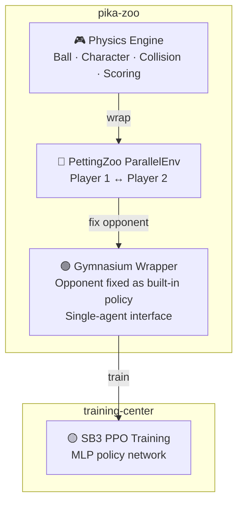

# pika-zoo

[](https://github.com/alphachu-volleyball/pika-zoo/releases)
[](https://www.python.org/)

Python port of [Pikachu Volleyball Game](https://gorisanson.github.io/pikachu-volleyball/en/) as a [PettingZoo](https://pettingzoo.farama.org/) / [Gymnasium](https://gymnasium.farama.org/) reinforcement learning environment.

> **Original game**: Pikachu Volleyball (対戦ぴかちゅ～　ﾋﾞｰﾁﾊﾞﾚｰ編)
> — 1997 (C) SACHI SOFT / SAWAYAKAN Programmers, Satoshi Takenouchi
>
> **Reverse-engineered JS**: [gorisanson/pikachu-volleyball](https://github.com/gorisanson/pikachu-volleyball)
> — The source code this project is based on

## Overview

Python port of the reverse-engineered JS source code, wrapped with standard RL interfaces. Provides utilities for RL training, evaluation, and visualization:

- **Physics Engine**: Accurately reproduces the original ball trajectory, character movement, net collision, and scoring logic
- **PettingZoo**: Two-player multi-agent environment (`ParallelEnv`)
- **Gymnasium**: Single-agent wrapper (opponent fixed with a built-in policy)
- **Wrappers**: Action/observation simplification, normalization, reward shaping — all opt-in and composable
- **Rendering**: Pygame-based visualization with player skins, score overlay, and headless MP4 recording
- **Episode Recording**: Per-round statistics, frame-by-frame state snapshots, and JSON export for replay analysis
- **AI Opponents**: BuiltinAI (original), DuckllAI (11 difficulty levels), StoneAI, RandomAI — pluggable via `AIPolicy` protocol
- **CLI**: `uv run play` for human play, AI matchups, custom keymaps, and batch recording; `uv run benchmark` for headless FPS measurement

### AI Opponents (vs Human)

<table>
<tr><td><b>BuiltinAI</b> (original)</td><td>

https://github.com/user-attachments/assets/fa7a05a3-22df-4b72-b579-f979b1b25402

</td></tr>
<tr><td><b>DuckllAI lv.10</b></td><td>

https://github.com/user-attachments/assets/6f32bf0b-a7ff-4eab-904c-96772075a7ea

</td></tr>
<tr><td><b>Custom RL Model</b></td><td>

https://github.com/user-attachments/assets/d777a247-46f2-4e6a-ba50-88054fd4d9d9

</td></tr>
<tr><td><b>RandomAI</b></td><td>

https://github.com/user-attachments/assets/579457a9-c018-4f51-816b-738511bbb660

</td></tr>
<tr><td><b>StoneAI</b></td><td>

https://github.com/user-attachments/assets/1fbf6c3b-8148-4077-b2c7-e97fd88d0cc3

</td></tr>
</table>

### RL Pipeline



> [!NOTE]
> **Why so complex?** — Pikachu Volleyball is a two-player game, but major RL libraries like SB3 only support single-agent training. We first create a multi-agent environment with PettingZoo, then use a Gymnasium wrapper that fixes the opponent inside the environment to make it look like a single-player game. During self-play, the opponent policy inside the wrapper is periodically swapped with past model versions.

## Quick Start

```bash
# Install
uv sync

# Run tests
uv run pytest

# Lint
uv run ruff check .
```

## Environment

- **Observation**: 35-element agent-centric vector `[self(13), opponent(13), ball(9)]` — [details](src/pika_zoo/env/README.md)
- **Action**: 18 discrete actions (3 x-dir x 3 y-dir x 2 power_hit) — [details](src/pika_zoo/env/README.md#action-space)
- **Wrappers**: opt-in, composable — [details](src/pika_zoo/wrappers/README.md)

```python
from pika_zoo.env import env
from pika_zoo.wrappers import SimplifyAction, SimplifyObservation, NormalizeObservation, ConvertSingleAgent

e = env(winning_score=15)
e = SimplifyAction(e)              # 18 → 13 relative actions
e = SimplifyObservation(e)         # mirror player_2 x-axis (optional)
e = NormalizeObservation(e)        # scale observations to [0, 1]
e = ConvertSingleAgent(e)          # PettingZoo → Gymnasium for SB3
```

## Physics Engine: Left-Right Asymmetry

The original Pikachu Volleyball uses integer-based physics with several left-right asymmetries (net collision boundary, power hit direction, wall bounce ranges, etc.). pika-zoo **intentionally preserves** these asymmetries so that RL agents train under the same conditions as the original game.

> [!IMPORTANT]
> Due to these asymmetries, **a single model cannot play both sides equally** unless `SimplifyObservation` is applied to mirror player_2's x-axis. By default, this project trains separate models for player 1 (left) and player 2 (right).

See [engine/README.md](src/pika_zoo/engine/README.md#left-right-asymmetry) for the full technical breakdown.

## Development

See [CLAUDE.md](CLAUDE.md) for the full development guide.

### Branch Workflow

```
feat/* ──(squash)──► release/{version} ──(merge)──► main ──► tag
```

## Related Projects

- [gorisanson/pikachu-volleyball](https://github.com/gorisanson/pikachu-volleyball) — Reverse-engineered JS reimplementation of the original game
- [duckll/pikachu-volleyball](https://github.com/duckll/pikachu-volleyball) — Enhanced AI (DuckllAI source)
- [helpingstar/pika-zoo](https://github.com/helpingstar/pika-zoo) — Pikachu Volleyball PettingZoo environment
- [hankluo6/Pikachu-VolleyBall-RL](https://github.com/hankluo6/Pikachu-VolleyBall-RL) — Prior work with PPO/ES
