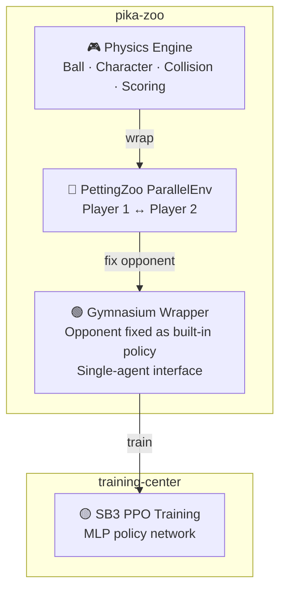

# pika-zoo

[](https://github.com/alphachu-volleyball/pika-zoo/releases)
[](https://www.python.org/)

Python port of [Pikachu Volleyball](https://github.com/gorisanson/pikachu-volleyball) (1997) as a [PettingZoo](https://pettingzoo.farama.org/) / [Gymnasium](https://gymnasium.farama.org/) reinforcement learning environment.

## Overview

A Python port of the reverse-engineered JS implementation of the original Pikachu Volleyball, wrapped with standard RL interfaces.

- **Physics Engine**: Accurately reproduces the original ball trajectory, character movement, net collision, and scoring logic
- **PettingZoo**: Two-player multi-agent environment (`ParallelEnv`)
- **Gymnasium**: Single-agent wrapper (opponent fixed with a built-in policy)

### RL Pipeline



> [!NOTE]
> **Why so complex?** — Pikachu Volleyball is a two-player game, but major RL libraries like SB3 only support single-agent training. We first create a multi-agent environment with PettingZoo, then use a Gymnasium wrapper that fixes the opponent inside the environment to make it look like a single-player game. During self-play, the opponent policy inside the wrapper is periodically swapped with past model versions.

## Quick Start

```bash
# Install
uv sync

# Run tests
uv run pytest

# Lint
uv run ruff check .
```

## Environment

### Observation Space

35-element agent-centric vector. Each agent sees `[self(13), opponent(13), ball(9)]`:

| Index | Feature | Range |
|-------|---------|-------|
| 0 | x | [0, 432] |
| 1 | y | [0, 244] |
| 2 | y_velocity | [-16, 16] |
| 3 | diving_direction | [-1, 1] |
| 4 | lying_down_duration_left | [-1, 3] |
| 5 | frame_number | [0, 4] |
| 6 | delay_before_next_frame | [0, 5] |
| 7-11 | state (one-hot: normal, jumping, power_hitting, diving, lying_down) | {0, 1} |
| 12 | prev_power_hit | {0, 1} |
| 13-25 | Opponent (same 13 features) | |
| 26-31 | ball x, y, prev_x, prev_y, prev_prev_x, prev_prev_y | |
| 32-33 | ball x_velocity, y_velocity | |
| 34 | ball is_power_hit | {0, 1} |

Coordinates are **absolute** (x=0 is left wall, x=432 is right). Use `SimplifyObservation` to mirror player_2's x-axis if needed.

### Action Space

18 discrete actions (3 x-directions x 3 y-directions x 2 power_hit). Use `SimplifyAction` to reduce to 13 relative actions (TOWARD_NET/AWAY_FROM_NET).

### Wrappers

Wrappers are opt-in and composable. Recommended stacking order:

```python
from pika_zoo.env import env
from pika_zoo.wrappers import (
    SimplifyAction,
    SimplifyObservation,
    NormalizeObservation,
    RewardShaping,
    ConvertSingleAgent,
)

e = env(winning_score=15)
e = SimplifyAction(e)              # 18 → 13 relative actions
e = SimplifyObservation(e)         # mirror player_2 x-axis (optional)
e = NormalizeObservation(e)        # scale observations to [0, 1]
e = RewardShaping(e)               # add shaped rewards (optional)
e = ConvertSingleAgent(e)          # PettingZoo → Gymnasium for SB3
```

| Wrapper | Effect |
|---------|--------|
| `SimplifyAction` | 18 absolute → 13 relative actions per player |
| `SimplifyObservation` | Mirror player_2 x-axis so both see left-side perspective |
| `NormalizeObservation` | Min-max scale to [0, 1] using known physical ranges |
| `RewardShaping` | Add ball-position and normal-state shaped rewards |
| `ConvertSingleAgent` | Multi-agent → single-agent (fixes opponent as AI policy) |
| `RecordEpisode` | Record per-frame state for replay/analysis |

### Ball Initialization Noise

```python
from pika_zoo.engine.types import NoiseConfig

# All noise parameters specify ± range (no defaults — must be explicit)
e = env(noise=NoiseConfig(x_range=5, x_velocity_range=3, y_velocity_range=0))
```

CLI:
```bash
uv run play --noise-x 5 --noise-x-vel 3    # enable noise with explicit values
uv run play                                  # no noise (normal mode)
```

## Physics Engine: Left-Right Asymmetry

The original Pikachu Volleyball uses integer-based physics with several left-right asymmetries (net collision boundary, power hit direction, wall bounce ranges, etc.). pika-zoo **intentionally preserves** these asymmetries so that RL agents train under the same conditions as the original game.

> [!IMPORTANT]
> Due to these asymmetries, **a single model cannot play both sides equally** unless `SimplifyObservation` is applied to mirror player_2's x-axis. By default, this project trains separate models for player 1 (left) and player 2 (right).

See [engine/README.md](src/pika_zoo/engine/README.md#left-right-asymmetry) for the full technical breakdown.

## Development

See [CLAUDE.md](CLAUDE.md) for the full development guide.

### Branch Workflow

```
feat/* ──(squash)──► release/{version} ──(merge)──► main ──► tag
```

## Related Projects

- [gorisanson/pikachu-volleyball](https://github.com/gorisanson/pikachu-volleyball) — Reverse-engineered JS reimplementation of the original game
- [helpingstar/pika-zoo](https://github.com/helpingstar/pika-zoo) — Pikachu Volleyball PettingZoo environment
- [hankluo6/Pikachu-VolleyBall-RL](https://github.com/hankluo6/Pikachu-VolleyBall-RL) — Prior work with PPO/ES
