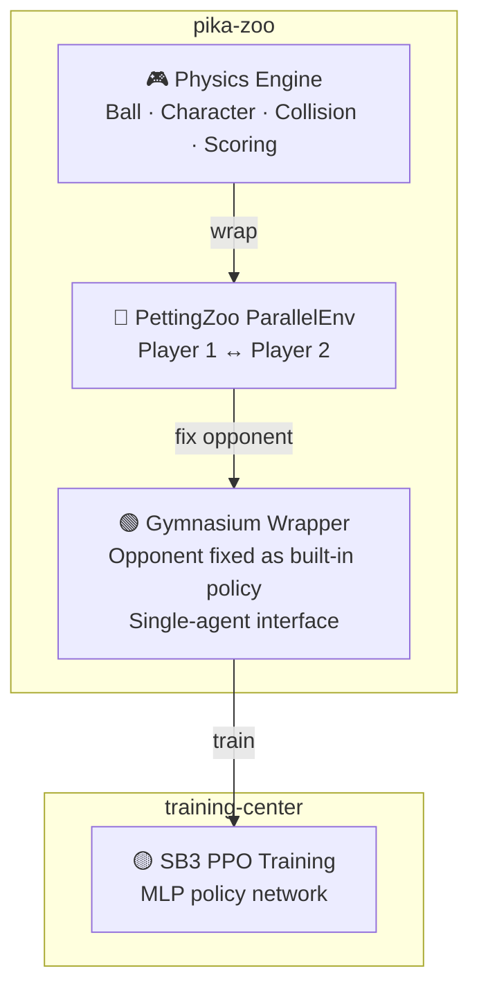

# pika-zoo

[](https://github.com/alphachu-volleyball/pika-zoo/releases)
[](https://www.python.org/)

Python port of [Pikachu Volleyball](https://github.com/gorisanson/pikachu-volleyball) (1997) as a [PettingZoo](https://pettingzoo.farama.org/) / [Gymnasium](https://gymnasium.farama.org/) reinforcement learning environment.

## Overview

A Python port of the reverse-engineered JS implementation of the original Pikachu Volleyball, wrapped with standard RL interfaces.

- **Physics Engine**: Accurately reproduces the original ball trajectory, character movement, net collision, and scoring logic
- **PettingZoo**: Two-player multi-agent environment (`ParallelEnv`)
- **Gymnasium**: Single-agent wrapper (opponent fixed with a built-in policy)

### RL Pipeline



> [!NOTE]
> **Why so complex?** — Pikachu Volleyball is a two-player game, but major RL libraries like SB3 only support single-agent training. We first create a multi-agent environment with PettingZoo, then use a Gymnasium wrapper that fixes the opponent inside the environment to make it look like a single-player game. During self-play, the opponent policy inside the wrapper is periodically swapped with past model versions.

## Quick Start

```bash
# Install
uv sync

# Run tests
uv run pytest

# Lint
uv run ruff check .
```

## Environment

### Observation Space

Low-dimensional vector observations (positions, velocities, etc.)

### Action Space

Discrete action space (directional keys + jump combinations)

## Physics Engine: Left-Right Asymmetry

The original Pikachu Volleyball uses integer-based physics with several left-right asymmetries.
pika-zoo **intentionally preserves** these asymmetries so that RL agents train under the same conditions as the original game.

> [!IMPORTANT]
> Due to these asymmetries, **a single model cannot play both sides equally.** This project trains separate models for player 1 (left) and player 2 (right) without observation mirroring.

### 1. Net collision boundary

When the ball hits the side of the net pillar, its horizontal direction is determined by which side of center (`x = 216`) it is on.
The condition uses strict less-than (`<`), so a ball at exactly `x = 216` is treated as being on the **right side** and pushed rightward.
The net's effective center is biased 1px to the right.

### 2. Net collision: actual vs predicted

The physics engine uses two separate collision checks for the ball against the top of the net:

- **Actual ball**: uses `<=` (ball at the boundary counts as top collision, vertical bounce)
- **Predicted ball** (for AI landing-point calculation): uses `<` (same position counts as side collision, horizontal bounce)

At the exact boundary value, the real ball bounces vertically but the built-in AI predicts a horizontal bounce — causing occasional mispredictions.

### 3. Power hit direction

A power hit's horizontal direction is determined by **which side of the court the ball is on**, not by which player hit it or their input direction.
The player's directional input affects only the **speed** (10 if no direction key, 20 if any direction key is held), while the `abs()` strips the actual direction.

If a player jumps near the net and power-hits while the ball is on the opponent's side, the ball flies back into their own court.
At `x = 216`, the ball is treated as right-side (same `<` boundary as net collision).

### 4. Wall bounce asymmetry

- **Left wall**: ball bounces when its center < `BALL_RADIUS` (20) — effectively when the ball's **surface** touches `x = 0`
- **Right wall**: ball bounces when its center > `GROUND_WIDTH` (432) — the ball's **center** must pass the wall, ignoring the radius

This means the ball can travel 20px further to the right before bouncing. Measured from center court (216): 196px to the left wall, 216px to the right wall.

### 5. Input asymmetry (resolved)

The original game uses absolute directional keys (LEFT/RIGHT), which have different meanings for each player.
This is resolved by the `SimplifyAction` wrapper, which maps 13 relative actions (TOWARD_NET/AWAY_FROM_NET) to the correct absolute directions per player.

### Design decisions

- Asymmetries 1–4 are preserved from the original game to ensure RL agents train in an authentic environment
- Separate models are trained for player 1 (left) and player 2 (right)
- No observation mirroring is applied — this would hide the physical asymmetries from the agent

## Development

See [CLAUDE.md](CLAUDE.md) for the full development guide.

### Branch Workflow

```
feat/* ──(squash)──► release/{version} ──(merge)──► main ──► tag
```

## Related Projects

- [gorisanson/pikachu-volleyball](https://github.com/gorisanson/pikachu-volleyball) — Reverse-engineered JS reimplementation of the original game
- [helpingstar/pika-zoo](https://github.com/helpingstar/pika-zoo) — Pikachu Volleyball PettingZoo environment
- [hankluo6/Pikachu-VolleyBall-RL](https://github.com/hankluo6/Pikachu-VolleyBall-RL) — Prior work with PPO/ES
