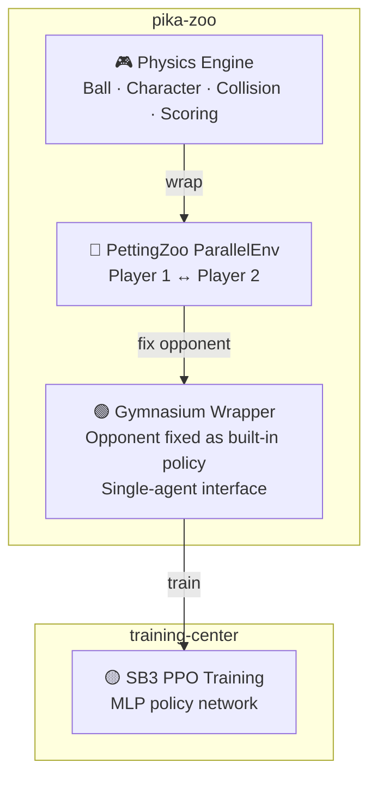

# pika-zoo

[](https://www.python.org/)

Python port of [Pikachu Volleyball](https://github.com/gorisanson/pikachu-volleyball) (1997) as a [PettingZoo](https://pettingzoo.farama.org/) / [Gymnasium](https://gymnasium.farama.org/) reinforcement learning environment.

## Overview

A Python port of the reverse-engineered JS implementation of the original Pikachu Volleyball, wrapped with standard RL interfaces.

- **Physics Engine**: Accurately reproduces the original ball trajectory, character movement, net collision, and scoring logic
- **PettingZoo**: Two-player multi-agent environment (`ParallelEnv`)
- **Gymnasium**: Single-agent wrapper (opponent fixed with a built-in policy)

### RL Pipeline



> [!NOTE]
> **Why so complex?** — Pikachu Volleyball is a two-player game, but major RL libraries like SB3 only support single-agent training. We first create a multi-agent environment with PettingZoo, then use a Gymnasium wrapper that fixes the opponent inside the environment to make it look like a single-player game. During self-play, the opponent policy inside the wrapper is periodically swapped with past model versions.

## Quick Start

```bash
# Install
uv sync

# Run tests
uv run pytest

# Lint
uv run ruff check .
```

## Environment

### Observation Space

Low-dimensional vector observations (positions, velocities, etc.)

### Action Space

Discrete action space (directional keys + jump combinations)

## Development

See [CLAUDE.md](CLAUDE.md) for the full development guide.

### Branch Workflow

```
feat/* ──(squash)──► release/{version} ──(merge)──► main ──► tag
```

## Related Projects

- [gorisanson/pikachu-volleyball](https://github.com/gorisanson/pikachu-volleyball) — Reverse-engineered JS reimplementation of the original game
- [helpingstar/pika-zoo](https://github.com/helpingstar/pika-zoo) — Pikachu Volleyball PettingZoo environment
- [hankluo6/Pikachu-VolleyBall-RL](https://github.com/hankluo6/Pikachu-VolleyBall-RL) — Prior work with PPO/ES
